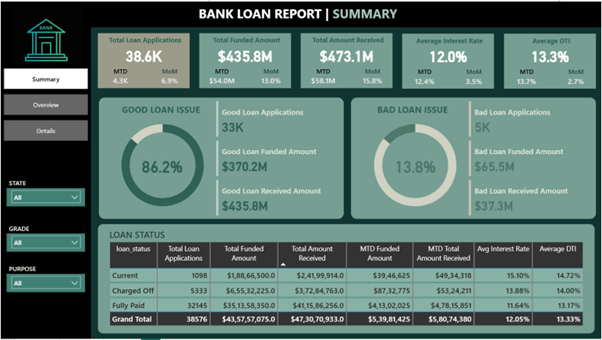
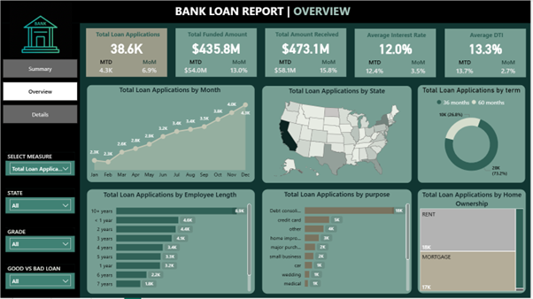
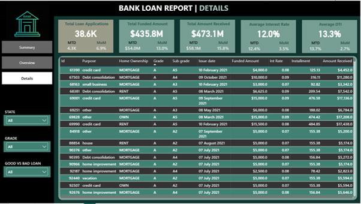

# Bank Loan Report Data Analysis Project (SQL + Power BI)

## 📊 Project Overview
This project analyzes a bank’s lending performance using SQL for data preparation and Power BI for interactive visualization. The focus is on loan applications, funded amounts, repayments, interest rates, borrower metrics, and regional trends. The goal is to generate actionable insights to monitor loan performance and understand borrower behavior.

## 🛠 Tools & Technologies
- **SQL (PostgreSQL):** Data cleaning, transformation, validation, and KPI calculations  
- **Power BI (Desktop):** Dashboard creation, visualization, and KPI reporting  
- **Excel:** Supplementary data validation and organization  

## ⚙️ Project Workflow

### 1. SQL Data Preparation
- Imported and structured loan data in PostgreSQL  
- Cleaned and transformed data: standardized datatypes, removed invalid values, formatted numeric and date columns  
- Executed SQL queries to calculate KPIs (Total Loan Applications, Funded Amount, Amount Received, Interest Rate, DTI)  
- Documented queries in Word and cross-verified results with Power BI outputs  

### 2. Power BI Dashboard
- Connected Power BI to the cleaned SQL database  
- Built interactive dashboards with KPIs, charts, and slicers  
- Visualized metrics: loan performance, borrower demographics, regional distribution, monthly trends  
- Applied DAX measures, calculated columns, and conditional formatting for advanced analytics  
- Customized dashboard with a **green-themed color palette** for professional design  

## 📈 Dashboards & KPIs

### **Dashboard 1: Summary**
- Total Loan Applications (MTD, PMTD)  
- Total Funded Amount (MTD, PMTD)  
- Total Amount Received (MTD, PMTD)  
- Average Interest Rate and DTI  
- Good vs. Bad Loan Analysis  
- Loan Status Grid  

### **Dashboard 2: Overview**
- Monthly Trends (Line Chart)  
- Regional Analysis (Map / Shape Map)  
- Loan Term Distribution (Donut Chart)  
- Employment Length Analysis (Bar Chart)  
- Loan Purpose Breakdown (Bar Chart)  
- Home Ownership Analysis (Tree Map)  

### **Dashboard 3: Details**
- Consolidated view of all loans, borrower profiles, and repayment data  

## 🖼️ Dashboard Screenshots

## 📄 SQL Queries

All SQL queries performed for data preparation and KPI calculations are documented here: 

[PostgreSQL Queries Screenshots](SQL%20Queries/postgresql%20queries%20screenshots.docx)

## 🧩 Skills Learned
- **SQL:** Joins, CTEs, aggregations, partitioning, date functions, KPI calculations  
- **Power BI:** Data modeling, Power Query, DAX measures, calculated columns, slicers, dashboard design  
- **Excel:** Data validation, quality checks, preliminary analysis  

## 🎯 Outcome
- Developed a comprehensive loan performance monitoring system  
- Enabled analysis of repayment efficiency, borrower behavior, and good vs. bad loans  
- Provided interactive visual insights for data-driven decision-making in banking operations  

---

**Author:** Iffath  
**Project Type:** Data Analysis / Business Intelligence
